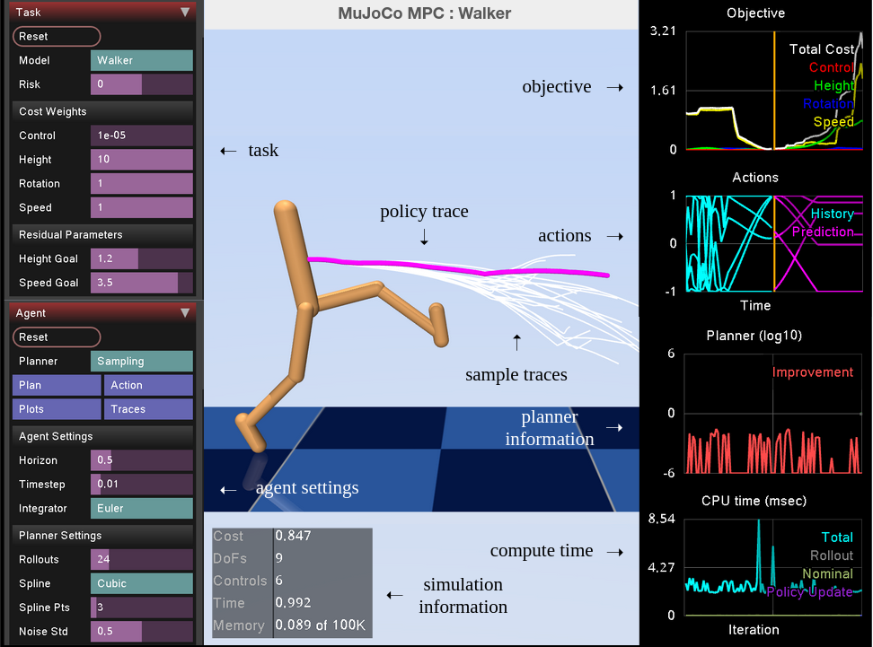

# Graphical User Interface

- [Graphical User Interface](#graphical-user-interface)
  - [Overview](#overview)
  - [User Guide](#user-guide)

## Overview

The MJPC GUI is built on top of MuJoCo's `simulate` application with a few additional features. The below screenshot shows a capture of the GUI for the `walker` task.

## User Guide

- Press `F1` to bring up a help pane that describes how to use the GUI.
- The MJPC GUI is an extension of MuJoCo's native `simulate` viewer, with the same keyboard shortcuts and mouse functionality.
    - `+` speeds up the simulation, resulting in fewer planning steps per simulation step.
    - `-` slows down the simulation, resulting in more planning steps per simulation step.
- The `simulate` viewer enables drag-and-drop interaction with simulated objects to apply forces or torques.
    - Double-click on a body to select it.
    - `Ctrl + left drag` applies a torque to the selected object, resulting in rotation.
    - `Ctrl + right drag` applies a force to the selected object in the `(x,z)` plane, resulting in translation.
    - `Ctrl + Shift + right drag` applies a force to the selected object in the `(x,y)` plane.
- MJPC adds three keyboard shortcuts:
    - The `Enter` key starts and stops the planner.
    - The `\` key starts and stops the controller (sending actions from the planner to the model).
    - The `9` key turns the traces on/off.
